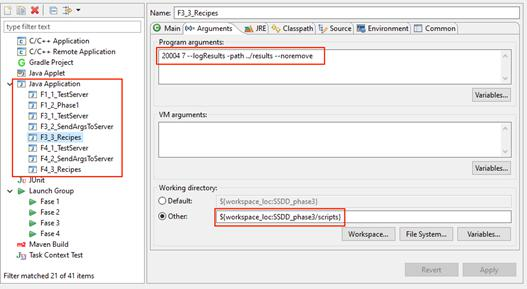
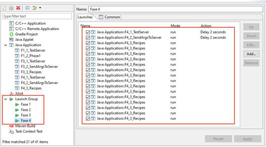
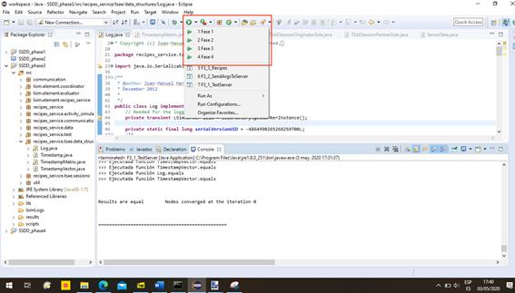

# SSDD_PR3_phase4.1

Para la realización de esta práctica estoy utilizando Eclipse bajo el S.O. Windows 10, versión 1909. Los componentes que utilizo son:
-	Java JDK 1.8.0_251-b08 de 64-bits.
-	Eclipse Neon 3 versión 4.6.3, edición para Java Developers.
- Plugin de Eclipse “C/C++ Remote (over TCF/TE) Run/Debug Launcher”, ver. 1.4.0.

El principal problema de la práctica es que está pensada para realizarse bajo entornos Linux. Así, tuve que analizar el fichero “start.sh” y decidí instalar el componente de lanzamiento remoto que sirve para lanzar secuencialmente varias ejecuciones y que, a pesar de su nombre, funciona con cualquier lenguaje.
Para cada fase tuve que crear configuraciones de ejecución para cada componente:

 
Es necesario poner especial cuidado en pasar los mismos argumentos que pondríamos al ejecutar el script, además de ejecutarlos desde el directorio “/scripts”.
Acto seguido creé las secuencias de lanzamiento de componentes utilizando el plugin de lanzamiento remoto:

 
Una de las cosas que permite el plugin de lanzamiento es ejecutar una acción tras realizar un lanzamiento. Gracias a esto, puedo introducir un retraso entre el lanzamiento del servidor local y el resto de los componentes, como pasa en el script.
Con todo configurado, los grupos de lanzamiento aparecen en el menú de ejecución. Las pruebas locales se ejecutan con normalidad, y es posible debugear y acceder a la salida de todos los procesos.

